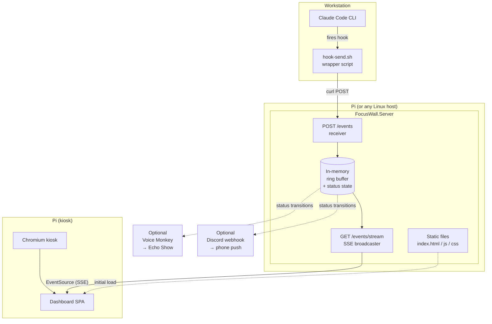
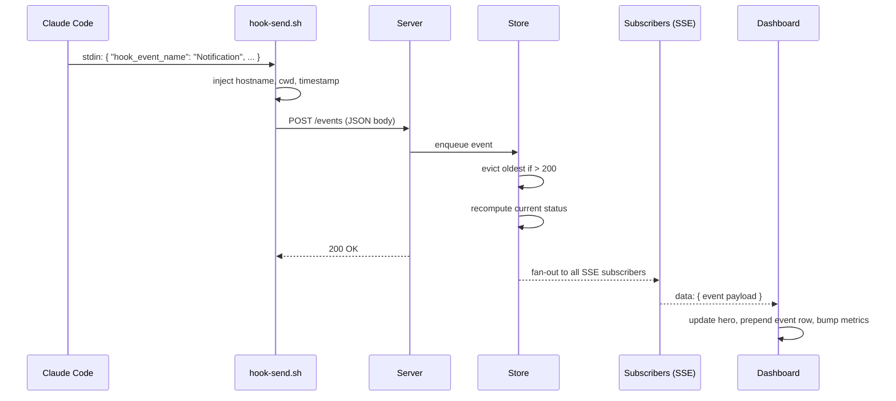
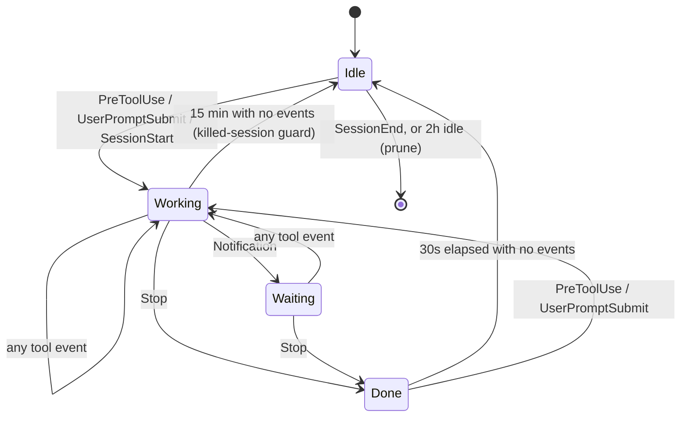
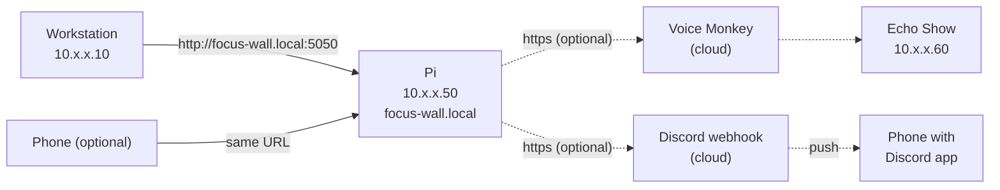

# Architecture

This document describes what the system is, how the parts fit together, and why the technology choices were made. Read this once before opening `IMPLEMENTATION.md`.

## Components



### What each component does

**Claude Code CLI** — Runs on your workstation. You don't modify it. It fires hooks at lifecycle events (Notification, Stop, PreToolUse, PostToolUse, SessionStart, SessionEnd). Hook payloads arrive on the hook's stdin as JSON.

**hook-send.sh wrapper** — A 10-line bash script. Reads the JSON from stdin, injects `hostname` and `cwd` fields, POSTs the result to the server. Living in shell instead of inline curl means you can change the URL or add fields in one place.

**FocusWall.Server** — A small ASP.NET minimal API. Three responsibilities: receive events, hold short-term state, broadcast to subscribers. About 200 lines of C# total.

**Dashboard SPA** — One HTML file, one JS file, one CSS file. Subscribes to the SSE stream with `EventSource`, renders the hero status and event log. No framework — vanilla JS is plenty for this surface area.

**Chromium kiosk** — Chromium browser running fullscreen with no chrome (toolbars, tabs, address bar) on the Pi. Points at `http://localhost:5050/`. Autorestarts on Pi boot.

**Optional Echo Show announcer** — A background service in the same server. On status transitions to `waiting`, it hits the Voice Monkey webhook, which makes an Echo Show speak the alert out loud. Pure audio backstop for when you're not in sight of the wall. See `ECHO_SHOW.md` for setup.

**Optional Discord notifier** — Another background service in the same server, structurally identical to the Echo Show announcer. On status transitions to `waiting`, it POSTs a rich embed to a Discord webhook, which fires a push notification on your phone via the Discord app. Reaches you anywhere with signal. See `DISCORD.md` for setup.

## Data flow — event lifecycle



The whole loop is sub-100ms on a LAN. The hook doesn't block on dashboard rendering — Claude Code only waits for the curl HTTP 200, which is the receiver writing to an in-memory queue.

## Event schema

### What Claude Code gives you

Every hook receives JSON on stdin. The shape varies by event but always includes `hook_event_name`. Examples (these are the fields you care about — Claude Code includes others):

```jsonc
// Notification
{
  "hook_event_name": "Notification",
  "session_id": "abc123...",
  "message": "Claude needs permission to use the Edit tool"
}

// Stop
{
  "hook_event_name": "Stop",
  "session_id": "abc123...",
  "stop_hook_reason": "end_turn"
}

// PreToolUse / PostToolUse
{
  "hook_event_name": "PreToolUse",
  "session_id": "abc123...",
  "tool_name": "Edit",
  "tool_input": { "file_path": "src/handlers/email.ts", ... }
}

// SessionStart
{
  "hook_event_name": "SessionStart",
  "session_id": "abc123...",
  "source": "startup" // or "resume", "clear", "compact"
}
```

Treat unknown fields as data — don't assume the shape. Pass the payload through and let the dashboard pick out what it needs, with one deliberate exception: the wrapper reduces `tool_input` to just `file_path` (privacy + payload size — see below).

### What the wrapper adds (and removes)

The wrapper also strips `tool_input` down to its `file_path` before sending — raw payloads carry full Bash command lines and entire `Write` file bodies, which should never leave the workstation (see the security model below).

```jsonc
{
  // ...all original fields above...
  "_meta": {
    "hostname": "workstation-1",
    "cwd": "/home/you/src/my-project",
    "received_at_client": "2026-05-22T14:29:54.123Z"
  }
}
```

### What the server stores

```jsonc
{
  "id": "uuid-v4-here",                       // server-assigned
  "received_at": "2026-05-22T14:29:54.456Z",  // server clock
  "session_key": {                            // extracted for indexing
    "hostname": "workstation-1",
    "session_id": "abc123..."
  },
  "payload": { /* whatever came in */ }
}
```

Session identity is extracted from `_meta.hostname` (from the wrapper) and `session_id` (from Claude Code's payload) at insert time so the store can index events by session without re-parsing the payload on every lookup.

## Status state machine

The dashboard hero is derived from event history, not sent by Claude Code directly — that flexibility lets you tune the rules without touching hook config. **Every Claude Code session runs its own independent state machine.** The dashboard hero is the "loudest" status across all active sessions.

### Per-session state machine



Session identity is `(hostname, session_id)` — hostname from the wrapper script's `_meta`, `session_id` from Claude Code's own hook payload. Sub-agents share the parent's `session_id`, so they don't fragment the state.

### Per-session rules

- **Idle** — The session's Done aged out (30s), or a Working session went silent for 15 minutes. That decay window is a killed-session guard: a terminal closed hard never sends `SessionEnd`, and without it the wall would show "Working" until the 2-hour prune. It is deliberately generous because a long-running tool call (test suite, build) emits nothing between PreToolUse and PostToolUse and must not flap the hero.
- **Working** — Most recent event was a tool event (Pre/PostToolUse), user submission, or session start.
- **Waiting** — Most recent event was a Notification. The "look at me" state. Never decays — Claude stays blocked until you act.
- **Done** — Most recent event was Stop. After 30s of silence, transitions to Idle.

### Why "Waiting" sticks

A Notification means Claude is blocked on you. There's no separate "permission granted" event — what unblocks Claude is your input, which causes a downstream `UserPromptSubmit` / `PreToolUse`. So "Waiting" naturally clears the next time that session does anything.

### Global "loudest wins" logic

The dashboard hero and the announcer both look at the same derived global status:

```
priority = { waiting: 4, working: 3, done: 2, idle: 1 }
global.status = max(session.status for session in active_sessions, key=priority)
```

If **any** session is waiting, the hero shows "Waiting for you," no matter how many other sessions are running tools. The subtitle names which session (its `cwd`, e.g. `my-project`) so you know where to look. A "1 waiting · 2 working" footer gives the fleet count.

### Example — two concurrent sessions

```mermaid
gantt
    title Two sessions running in parallel
    dateFormat  HH:mm:ss
    axisFormat  %H:%M:%S
    section Session A (my-project)
    Working    :a1, 14:00:00, 90s
    Waiting    :crit, a2, after a1, 120s
    Working    :a3, after a2, 60s
    section Session B (harvest-timestar)
    Working    :b1, 14:00:30, 180s
    Done       :b2, after b1, 30s
    Idle       :b3, after b2, 60s
    section Global hero
    Working    :g1, 14:00:00, 90s
    Waiting    :crit, g2, after g1, 120s
    Working    :g3, after g2, 60s
```



While A is Waiting and B is Working, the hero stays on Waiting — even though B keeps generating events. That's the bug the single-status MVP would have.

## Session cleanup

Sessions get pruned from the store when:

- A `SessionEnd` event arrives — the session is removed immediately.
- No event for 2 hours — the session is considered abandoned and dropped during the next heartbeat tick.

The event log itself keeps the last 200 entries regardless of session (already the case in the MVP).

## Status-to-color mapping

This mapping drives the dashboard hero (and any future output channel that wants to use it). Define it once on the server, reference it everywhere.

| Status | Color | Hex |
|--------|-------|-----|
| Waiting | Amber | `#BA7517` |
| Working | Blue | `#378ADD` |
| Done | Green | `#1D9E75` |
| Idle | Dim gray | `#888780` |

Amber rather than red for "Waiting" — red feels alarming, you want this to read as "your turn" not "emergency."

## Technology decisions

These are the choices and why they were made. If you want to swap one, this is where to push back.

### ASP.NET minimal API for the server

**Why:** You live in `.NET`-land daily. The whole server is around 200 lines and `dotnet publish` produces a single self-contained binary that runs anywhere. AOT compilation gives a ~10MB native binary if size matters on the Pi.

**Alternative considered:** Node.js / Python FastAPI. Both fine. Stay with what you know unless you have a reason.

### Server-Sent Events over WebSockets

**Why:** SSE is built into browsers (`EventSource`), survives proxy hops better, auto-reconnects, and the traffic is one-way (server → dashboard) which is exactly what SSE is for. WebSockets add complexity (heartbeats, frames, libraries) for no benefit here.

**When you'd want WebSockets instead:** If the dashboard needs to send things to the server (snooze button being a good example). At that point either upgrade to WS or just add a `POST /snooze` endpoint — the latter is simpler.

### In-memory ring buffer (no DB by default)

**Why:** For a focus dashboard, you don't need history older than the current session. Restart = clean slate is fine. Adding SQLite is one file change later if you change your mind.

**Capacity:** 200 events is roughly an hour of heavy Claude Code usage. Tunable via a constant in `Program.cs`.

### Vanilla JS on the dashboard

**Why:** The dashboard updates a fixed set of DOM nodes when events arrive. There's no routing, no state library, no build step. A framework would be more code than the app itself.

**When you'd want a framework:** When you start adding interactive features (snooze, filter, per-host tabs). Even then, Alpine.js or HTMX gets you there without a build pipeline. React only if you genuinely want a SPA.

### Docker on the Pi

**Why:** You already use Docker. `docker compose up -d` plus `restart: unless-stopped` is the simplest "service that survives reboots" pattern. systemd-direct would work too — Docker buys you the same isolation and update workflow you have everywhere else.

**Alternative:** `dotnet publish --self-contained -r linux-arm64` and a systemd unit file. Saves ~50MB of image overhead. Use this if disk space is tight on the SD card.

### Self-hosted GitHub Actions runner for deploy (optional)

**Why:** A self-hosted runner living on the Pi connects outbound to GitHub, so `git push` triggers a local `docker compose up -d --build` with no inbound port opened and no image registry to manage. It builds natively for the Pi's own `arm64`, avoiding the cross-compile dance in the manual `buildx` path. Functionally it's just automating the SSH-and-pull step you'd otherwise do by hand — see `DEPLOYMENT.md` § 4a.

**Requires the repo to be private.** GitHub's own guidance: self-hosted runners on public repos let a PR's workflow code execute on the runner — here, that's your physical hardware. Don't enable this on a public repo.

**Alternative considered:** Push a pre-built image to GHCR (GitHub Container Registry) and have the Pi `docker compose pull`. Slightly faster (the build happens on a cloud runner, not the Pi) and doesn't require registering the Pi as a runner at all — but it adds a registry, auth secrets for it, and still needs something on the Pi to notice a new image exists (cron or Watchtower). For a single-Pi personal project, the self-hosted-runner path has fewer moving parts overall.

### Chromium kiosk, not Electron / Tauri / custom display app

**Why:** Chromium kiosk is one command line flag. The dashboard is a web app already. Building a native display app would mean shipping two front-ends.

**Gotcha:** Chromium memory creeps over days. A `cron` job that restarts Chromium nightly at 3am is in `DEPLOYMENT.md`.

## Network topology



- **mDNS** (`focus-wall.local`) avoids hardcoding IPs and survives DHCP lease changes. Raspberry Pi OS publishes mDNS out of the box. Most Linux distros and all macOS / iOS resolve `.local` natively; some Windows setups need Bonjour installed.
- **Port 5050** is arbitrary — any unused port works. Avoid 80 to keep things sudoless.
- **No reverse proxy** for v1. If you later want HTTPS or auth, drop Caddy in front — its config file is shorter than its README.
- **Voice Monkey and Discord are both cloud services** — their outbound paths go Pi → public internet → provider → device. Both need egress on 443. The dashboard itself stays fully local.

## Security model

This system lives entirely on your home/office LAN. The threat model is roughly "someone on the same LAN being mildly mischievous," not nation-states. Choices:

- **No authentication on `POST /events`** — Anyone on the LAN can post events. Worst case, your dashboard shows garbage. If this matters, add a static bearer token in an env var the wrapper script includes (`Authorization: Bearer …`).
- **No authentication on `GET /events/stream`** — Same reasoning.
- **No TLS** — Plain HTTP on LAN. If you put this on the public internet (you shouldn't), add Caddy with automatic Let's Encrypt and basic auth.
- **Payload hygiene matters** — Raw `PreToolUse` payloads include the full `tool_input`: complete Bash command lines and entire `Write` file bodies, i.e. actual source code. The wrapper therefore strips `tool_input` down to `file_path` before sending (see `hook-send.sh`), so nothing beyond file paths and tool names reaches the server. This also keeps events small for the ring buffer and SSE replay. Don't remove that filter without accepting that anyone on the LAN can read your code via `GET /events`.

## Failure modes and their handling

| Failure | What happens | Mitigation |
|---------|-------------|------------|
| Server down when hook fires | curl fails silently in the background; Claude Code never notices | Wrapper backgrounds the POST and caps it with `--connect-timeout` / `--max-time`; a down or unreachable server adds zero latency to tool calls |
| SSE disconnects (Wi-Fi blip) | Dashboard shows "reconnecting" banner; `EventSource` auto-retries | Server replays last N events on reconnect so dashboard catches up |
| Pi reboots | Container restarts; Chromium restarts; dashboard re-subscribes | All `restart: unless-stopped` + systemd autostart |
| Server crashes | Docker restarts it; in-memory events lost | Acceptable; add SQLite (Phase 6b) if not |
| Voice Monkey offline / unreachable | Server hits HTTPS timeout on status change; logs warning; dashboard unaffected | Timeout = 3s, fire-and-forget |
| Discord webhook offline / invalid | Same as Voice Monkey — HTTPS timeout or 4xx logged; dashboard and other channels unaffected | Timeout = 3s, fire-and-forget |
| Wrapper script missing on workstation | Hook fires nothing | Run the smoke test in `IMPLEMENTATION.md` after installing — the wrapper deliberately never exits non-zero, so failures are silent by design |

## What's deliberately not in scope

Calling these out so you don't go looking for them later:

- **Auth / multi-user** — Single-user system on a trusted LAN.
- **Mobile push notifications** — The point is the wall. Phone push would duplicate what your phone already does. If you want it, point your phone at the dashboard URL when you walk away.
- **Cloud sync** — Local-only by design.
- **Pretty animations / transitions** — A wall display benefits from stillness. Subtle changes only.
- **Logging / observability stack** — `docker logs` is enough.

Move on to `IMPLEMENTATION.md` once this all makes sense.
