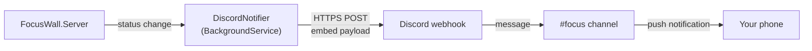

# Discord notifications (Phase 6b)

Optional add-on to the Pi wall display: when Claude flips to **waiting**, post a rich embed to a Discord channel via webhook. If you already have Discord's mobile app installed with notifications enabled, this reaches you anywhere with phone signal — outside the house, in a different building, wherever.

This is **additive** to the wall display and Echo Show announcer. All three can coexist and fire simultaneously; the design assumes each channel matches a different physical context (wall = at desk, Echo = in the room, Discord = anywhere with your phone).

## Why Discord

Discord webhooks are the shortest path from "server has an event" to "notification on your phone" that exists without app development. No OAuth, no bot registration, no Amazon developer account. You create a webhook URL in channel settings, your server POSTs JSON to it, a message appears in the channel. That's the whole integration.

Compared to alternatives:

- **vs Echo Show announcements** — Discord works anywhere; Echo Show only works in earshot. Discord is silent unless you enable push notifications; Echo Show is audible to everyone in the room. Complementary, not competing.
- **vs Slack webhooks** — Same shape, same code, works fine. Swap the URL and payload format. If Slack is where you spend your day, use Slack. Discord is chosen here because most people leave it running for personal use and have push already configured.
- **vs email / SMS / ntfy** — Slower delivery, more setup, or additional services. Discord webhooks are instant and free.

Trade-offs:

- **You need a Discord server you control**, or admin rights on one, to create webhooks. If you don't have one, make a personal server in 30 seconds — it can have exactly one channel called `#focus`.
- **Webhook URLs are secrets** — anyone with the URL can post to your channel. Treat it like a password; don't commit it to git.
- **Discord rate limits** apply. 5 requests per 2 seconds per webhook, 30 per minute total. The per-session cooldown below keeps you well under this.

## How it fits



`DiscordNotifier` is a `BackgroundService` that subscribes to the same status channel the SSE endpoint does, mirroring the `EchoAnnouncer` design. When a session transitions to `waiting` it fires the webhook with an amber embed; on `error` (Claude Code's `StopFailure` hook — API/connection failures) it fires a red "Claude hit an error" embed naming the reason. Per-session cooldown and quiet-hours logic mirror the announcer.

## One-time Discord setup

### 1. Pick or create a channel

If you already have a personal Discord server, pick any channel (a private one is fine — announcements from a webhook don't require anyone else to see them).

If you don't:

1. Discord → left sidebar → **+** → **Create My Own** → **For me and my friends**
2. Name it whatever (`My Notifications` works).
3. Create a channel: right-click the sidebar → **Create Channel** → text channel, name it `focus`.

### 2. Create the webhook

1. Right-click the `#focus` channel → **Edit Channel** → **Integrations** → **Webhooks** → **New Webhook**.
2. Name: `Claude Focus Wall`. Optional: upload an avatar image (any square PNG).
3. Click **Copy Webhook URL**. It looks like `https://discord.com/api/webhooks/1234567890/aBcDeFg...`.
4. Save the URL somewhere safe. Anyone with this URL can post to your channel; treat it like an API key.

### 3. Enable mobile push (optional but the whole point)

On your phone:

1. Discord → your server → the `#focus` channel → three-dot menu → **Notification Settings**.
2. Set to **All Messages**.
3. Confirm system notifications are enabled for the Discord app.

Do a quick test — you should get a phone push within a second of posting anything to `#focus`.

### 4. Smoke test from your laptop

```bash
curl -X POST "YOUR_WEBHOOK_URL" \
  -H "Content-Type: application/json" \
  -d '{"content": "hello from focus wall smoke test"}'
```

The message appears in `#focus` immediately. If it doesn't, check the URL is exactly what Discord gave you (no trailing spaces, no leading whitespace).

For the richer embed shape the server will actually send:

```bash
curl -X POST "YOUR_WEBHOOK_URL" \
  -H "Content-Type: application/json" \
  -d '{
    "username": "Claude Focus Wall",
    "embeds": [{
      "title": "Claude is waiting for you",
      "description": "Permission requested for Edit",
      "color": 12219671,
      "fields": [
        {"name": "Session", "value": "workstation-1/a3f8", "inline": true},
        {"name": "Project", "value": "my-project", "inline": true}
      ],
      "footer": {"text": "Claude Focus Wall"}
    }]
  }'
```

The number `12219671` is `0xBA7517` in decimal — the amber the wall uses. Discord takes color as a decimal integer.

**Do not move to server integration until the curl works.** Same rule as Echo Show — verify the boring path first.

## Server integration

One new file, one line added to `Program.cs`. Assumes Phase 1 is in place (session-keyed `EventStore` broadcasting `GlobalStatus` messages).

### `DiscordNotifier.cs`

```csharp
namespace FocusWall.Server;

using System.Text;
using System.Text.Json;

public class DiscordNotifier(
    EventStore store,
    IHttpClientFactory httpFactory,
    IConfiguration config,
    ILogger<DiscordNotifier> log) : BackgroundService
{
    private readonly string? _webhookUrl = config["DISCORD_WEBHOOK_URL"];
    private readonly string? _dashboardUrl = config["DISCORD_DASHBOARD_URL"];
    private readonly TimeSpan _cooldown = TimeSpan.FromSeconds(
        int.TryParse(config["DISCORD_COOLDOWN_SECONDS"], out var s) ? s : 120);
    private readonly TimeOnly? _quietStart =
        TimeOnly.TryParse(config["DISCORD_QUIET_START"], out var qs) ? qs : null;
    private readonly TimeOnly? _quietEnd =
        TimeOnly.TryParse(config["DISCORD_QUIET_END"], out var qe) ? qe : null;

    // Colors as decimal ints (Discord's embed.color format).
    // Matches the wall's palette in ARCHITECTURE.md.
    private const int ColorWaiting = 0xBA7517;  // amber
    private const int ColorError   = 0xC0392B;  // red — matches the usage page's "critical" severity

    // Sessions in either of these statuses get an alert. Keyed by the specific
    // status (not just set membership) below, so a waiting -> error or
    // error -> waiting transition still fires a fresh alert.
    private static readonly HashSet<string> AlertStatuses = new() { "waiting", "error" };

    private static readonly Dictionary<string, string> ErrorLabels = new()
    {
        ["rate_limit"] = "rate limited",
        ["overloaded"] = "overloaded",
        ["authentication_failed"] = "authentication failed",
        ["billing_error"] = "billing issue",
        ["server_error"] = "server error",
        ["invalid_request"] = "invalid request",
        ["model_not_found"] = "model not found",
        ["oauth_org_not_allowed"] = "OAuth blocked for org",
        ["unknown"] = "connection or unknown error",
    };

    // Per-session tracking, same pattern as EchoAnnouncer.
    private readonly Dictionary<SessionKey, string> _lastNotifiedStatus = new();
    private readonly Dictionary<SessionKey, DateTimeOffset> _lastNotifiedAt = new();

    protected override async Task ExecuteAsync(CancellationToken ct)
    {
        if (string.IsNullOrEmpty(_webhookUrl))
        {
            log.LogInformation("DiscordNotifier disabled — DISCORD_WEBHOOK_URL not set");
            return;
        }

        var (channel, id) = store.Subscribe();
        log.LogInformation("DiscordNotifier subscribed (cooldown {Cooldown}s per session)",
            (int)_cooldown.TotalSeconds);

        try
        {
            await foreach (var msg in channel.Reader.ReadAllAsync(ct))
            {
                if (msg.Kind != "status") continue;
                if (msg.Data is not GlobalStatus global) continue;

                // Notify for any session freshly transitioning into an alert
                // status (waiting or error) — keyed on the specific status so a
                // waiting -> error or error -> waiting transition still fires a
                // fresh alert instead of being swallowed as "already notified".
                foreach (var session in global.Sessions.Where(s => AlertStatuses.Contains(s.Status)))
                {
                    if (_lastNotifiedStatus.TryGetValue(session.Key, out var prev) && prev == session.Status)
                        continue;

                    if (global.SnoozedUntil > DateTimeOffset.UtcNow)
                    {
                        // Mark as notified so it doesn't back-fire the instant
                        // snooze ends — same bookkeeping as quiet hours.
                        log.LogInformation("Suppressed (snoozed) for {Session}", session.Key.Short);
                        _lastNotifiedStatus[session.Key] = session.Status;
                        continue;
                    }

                    if (IsQuietHours())
                    {
                        log.LogInformation("Suppressed (quiet hours) for {Session}", session.Key.Short);
                        _lastNotifiedStatus[session.Key] = session.Status;
                        continue;
                    }

                    if (_lastNotifiedAt.TryGetValue(session.Key, out var last)
                        && DateTimeOffset.UtcNow - last < _cooldown)
                    {
                        log.LogInformation("Suppressed (cooldown) for {Session}", session.Key.Short);
                        continue;
                    }

                    await NotifyAsync(session, ct);
                    _lastNotifiedAt[session.Key] = DateTimeOffset.UtcNow;
                    _lastNotifiedStatus[session.Key] = session.Status;
                }

                // Reset when a session leaves the alert set so the next alert fires again.
                foreach (var session in global.Sessions.Where(s => !AlertStatuses.Contains(s.Status)))
                    _lastNotifiedStatus[session.Key] = session.Status;

                // Prune ended sessions.
                var activeKeys = global.Sessions.Select(s => s.Key).ToHashSet();
                foreach (var k in _lastNotifiedStatus.Keys.Except(activeKeys).ToList())
                {
                    _lastNotifiedStatus.Remove(k);
                    _lastNotifiedAt.Remove(k);
                }
            }
        }
        catch (OperationCanceledException) { }
        finally { store.Unsubscribe(id); }
    }

    private async Task NotifyAsync(SessionState session, CancellationToken ct)
    {
        string title, description;
        int color;

        if (session.Status == "error")
        {
            title = "Claude hit an error";
            color = ColorError;
            description = ErrorLabel(session.LastEvent);
        }
        else
        {
            title = "Claude is waiting for you";
            color = ColorWaiting;
            // Try to pull the human-readable message from the triggering event.
            description = "Permission requested";
            if (session.LastEvent is { Payload: var payload }
                && payload.TryGetProperty("message", out var msgEl)
                && msgEl.ValueKind == JsonValueKind.String)
            {
                var m = msgEl.GetString();
                if (!string.IsNullOrWhiteSpace(m)) description = m!;
            }
        }

        var embed = new Dictionary<string, object?>
        {
            ["title"] = title,
            ["description"] = description,
            ["color"] = color,
            ["fields"] = new object[]
            {
                new { name = "Session", value = $"`{session.Key.Short}`", inline = true },
                new { name = "Project", value = $"`{session.Cwd ?? "(unknown)"}`", inline = true }
            },
            ["footer"] = new { text = "Claude Focus Wall" },
            ["timestamp"] = DateTimeOffset.UtcNow.ToString("o")
        };
        if (!string.IsNullOrEmpty(_dashboardUrl)) embed["url"] = _dashboardUrl;

        var body = JsonSerializer.Serialize(new
        {
            username = "Claude Focus Wall",
            embeds = new[] { embed }
        });

        try
        {
            using var http = httpFactory.CreateClient();
            http.Timeout = TimeSpan.FromSeconds(3);
            using var content = new StringContent(body, Encoding.UTF8, "application/json");
            var res = await http.PostAsync(_webhookUrl, content, ct);
            if (!res.IsSuccessStatusCode)
            {
                var responseBody = await res.Content.ReadAsStringAsync(ct);
                log.LogWarning("Discord returned {Status}: {Body}",
                    (int)res.StatusCode, responseBody);
            }
        }
        catch (Exception ex)
        {
            log.LogWarning(ex, "Discord webhook call failed");
        }
    }

    private static string ErrorLabel(EventEntry? lastEvent)
    {
        if (lastEvent is { Payload: var payload }
            && payload.TryGetProperty("error", out var errEl)
            && errEl.ValueKind == JsonValueKind.String)
        {
            var slug = errEl.GetString();
            if (slug is not null) return ErrorLabels.TryGetValue(slug, out var label) ? label : slug;
        }
        return "unknown error";
    }

    private bool IsQuietHours()
    {
        if (_quietStart is null || _quietEnd is null) return false;
        var now = TimeOnly.FromDateTime(DateTime.Now);
        return _quietStart < _quietEnd
            ? now >= _quietStart && now < _quietEnd
            : now >= _quietStart || now < _quietEnd;
    }
}
```

The structure is intentionally close to `EchoAnnouncer.cs` — same subscription pattern, same per-session cooldown logic, same quiet-hours behavior. If you're comfortable with one, the other reads as a small variation.

### `Program.cs` — one line added

Alongside the existing hosted service registrations:

```csharp
builder.Services.AddHostedService<DiscordNotifier>();
```

`AddHttpClient()` was already registered for `EchoAnnouncer`; if you're building this without Echo Show, add it here too.

## Configuration

Env vars, same pattern as the announcer. Add to `docker-compose.yml`:

```yaml
services:
  focus-wall:
    # ...existing fields...
    environment:
      TZ: "Etc/UTC"   # quiet hours evaluate in container-local time; default is UTC
      DISCORD_WEBHOOK_URL: "${DISCORD_WEBHOOK_URL}"
      DISCORD_DASHBOARD_URL: "http://focus-wall.local:5050/"
      DISCORD_COOLDOWN_SECONDS: "120"
      DISCORD_QUIET_START: "22:00"
      DISCORD_QUIET_END:   "07:30"
```

And in `.env` (gitignored):

```bash
DISCORD_WEBHOOK_URL=https://discord.com/api/webhooks/1234567890/aBcDeFg...
```

### What each setting does

| Variable | Default | What it does |
|----------|---------|--------------|
| `DISCORD_WEBHOOK_URL` | (none) | Required. The full webhook URL from Discord. |
| `DISCORD_DASHBOARD_URL` | (unset) | Optional. If set, the embed becomes clickable and opens the dashboard. Useful on mobile to jump straight to the wall from a phone notification. Only reachable while your phone is on the same LAN — leave unset if that's not the case. |
| `DISCORD_COOLDOWN_SECONDS` | 120 | Minimum gap between notifications for the *same session*. Two concurrent sessions both hitting waiting will both notify. |
| `DISCORD_QUIET_START` / `_END` | (unset) | Optional `HH:MM` window during which notifications are suppressed. Evaluated in the container's local time — set `TZ` in compose or the window runs on UTC. |

If `DISCORD_WEBHOOK_URL` is missing, the notifier disables itself on startup and logs a single info line. Dashboard and other channels are unaffected.

## Testing the integration

```bash
# 1. Bring up the server
cd ~/focus-wall
docker compose up -d
docker compose logs focus-wall | grep DiscordNotifier
# expected: "DiscordNotifier subscribed (cooldown 120s per session)"

# 2. Simulate a Notification event
curl -X POST http://focus-wall.local:5050/events \
  -H 'Content-Type: application/json' \
  -d '{
    "hook_event_name": "Notification",
    "session_id": "smoke-test",
    "message": "Permission requested for Edit"
  }'

# 3. Within ~2 seconds, an embed should appear in #focus and your phone should buzz
```

If the dashboard reflects the event but Discord doesn't:

```bash
docker compose logs focus-wall | tail -30
```

Look for `Discord returned` (Discord API error — often a stale/malformed webhook URL) or `Discord webhook call failed` (network problem). Discord returns a JSON body describing the problem on 400s; the log line includes it.

### Confirming per-session cooldown behavior

The Phase 1 multi-session logic means two concurrent sessions both hitting `waiting` should each get their own notification, even within the cooldown window.

```bash
# Session A goes waiting
curl -X POST http://focus-wall.local:5050/events \
  -H 'Content-Type: application/json' \
  -d '{"hook_event_name":"Notification","session_id":"sessA","message":"Perm A"}'

# Immediately (well within cooldown), Session B goes waiting
curl -X POST http://focus-wall.local:5050/events \
  -H 'Content-Type: application/json' \
  -d '{"hook_event_name":"Notification","session_id":"sessB","message":"Perm B"}'
```

You should get **two** Discord messages, not one. If you only get one, the cooldown is being applied globally instead of per-session — check `_lastNotifiedAt` is keyed by `SessionKey`.

## Tuning the experience

After a week of real use, the things you'll want to adjust:

**Ping yourself.** Add `content: "<@YOUR_DISCORD_ID>"` alongside `embeds` in the payload if you want the notification to specifically ping you (louder push, `@Mentions` filter friendly). Get your ID from Discord Settings → Advanced → Developer Mode → right-click your avatar → Copy User ID.

```csharp
// Alongside username and embeds
["content"] = $"<@{_userId}>",
```

**Multiple channels.** If you route different projects to different Discord channels, use one webhook URL per channel and pick based on `session.Cwd`. Simple `switch` in `NotifyAsync`.

**Slack instead.** Same code with two changes: the URL is a Slack incoming webhook, and the payload uses Slack's Block Kit shape (`blocks` array instead of `embeds`). The subscribe/cooldown/quiet-hours structure stays identical.

**Notify on done too.** Same warning as Echo Show — `Stop` fires per turn. If you want done notifications, gate by session duration:

```csharp
// Only notify on done if the session was working for over 5 minutes
if (session.Status == "done"
    && session.LastEvent != null
    && DateTimeOffset.UtcNow - session.StatusSince > TimeSpan.FromMinutes(5))
{
    // ...notify with different color/title...
}
```

## Failure modes

| Failure | What happens | What to do |
|---------|-------------|------------|
| Webhook URL invalid or deleted | HTTP 404 in logs on every waiting transition | Recreate the webhook in Discord, update `.env`, restart container |
| Discord API down | HTTPS timeout (3s); logged; other channels unaffected | Wait for Discord to recover |
| Rate limit hit (30/min) | HTTP 429 with `Retry-After` header | Extremely unlikely at 2-minute cooldown; raise cooldown if it happens |
| Pi loses internet | HTTPS request fails fast; dashboard still works on LAN | Same as API down |
| Push notifications not arriving on phone | Message posts to `#focus` but no phone alert | Discord → channel settings → All Messages; also check phone-level notification permissions for Discord |

Same pattern as everywhere else in this project: the dashboard is the reliable core, and every notification channel is a best-effort layer on top. A failing Discord webhook never touches the wall display.

## Alternative: a Discord bot instead of a webhook

If you outgrow webhooks — e.g. you want to *react* to messages, run slash commands like `/snooze 30m`, or DM you privately — the next step is a proper Discord bot. You'd:

1. Create an application at https://discord.com/developers/applications.
2. Add a bot user, copy the token.
3. Use `Discord.Net` NuGet in the server to connect, listen, and send.
4. Invite the bot to your server with the right scopes.

For a one-way "notify me" pipeline, this is significant overkill. Stick with webhooks until you have a specific reason to move.

## When to do this phase

Same guidance as Echo Show — build the core (Phase 1-4) first. This add-on is Phase 6b because it's a nice-to-have layer, not because it's hard.

That said, Discord notifications are often the *first* add-on people want because:
- Setup is 10 minutes end-to-end (no third-party service to sign up for).
- The value shows up immediately on your phone, not tied to a specific room.
- It complements rather than duplicates the wall's role.

If you had to pick one non-wall channel to build first, this is a reasonable choice.
