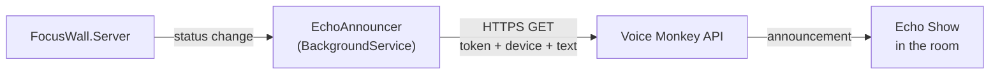

# Echo Show announcements (Phase 6a)

Optional add-on to the Pi wall display: when Claude flips to **waiting**, make an Echo Show in the room say "Claude is waiting for your input" out loud. Audio backstop for when the wall isn't in your sightline — kitchen, bedroom, the room you wandered into for coffee.

This is **additive** to the wall display, not a replacement. The Pi dashboard remains the primary glanceable surface; the Echo Show announcement is the "you've actually walked away" catch.

## Why Voice Monkey

Amazon does not let arbitrary servers push speech to an Echo. The official path — Alexa Skills Kit + Proactive Events API — requires building a published skill, picking from Amazon's fixed event schemas (none of which mean "your AI assistant needs you"), and respecting an undisclosed daily notification cap. Not worth it for a personal tool.

**Voice Monkey** (voicemonkey.io) is a third-party bridge that sits on the right side of that wall. You authorize it once against your Amazon account; it gives you a webhook URL; your server hits the URL with text; the Echo speaks it. No skill development, no Lambda, no certification.

Trade-offs you're accepting:

- **Third-party dependency.** If Voice Monkey goes down or changes pricing, you lose announcements. The Pi wall display keeps working independently — this is the reason it's layered, not replacing.
- **Free tier limits.** The free plan caps daily announcements; the paid tier is a few dollars a month. Verify current pricing on their site before committing.
- **Alexa account coupling.** You have to OAuth Voice Monkey into your Amazon account. Use your personal account, not a work one.

If those are dealbreakers, the self-hosted alternative is **Home Assistant** with the `alexa_media_player` integration — same outcome, no third party, but it's a weekend of setup vs ten minutes. Stub at the bottom of this file.

## How it fits



`EchoAnnouncer` is a `BackgroundService` that subscribes to the same status channel the SSE endpoint does. When a session transitions to `waiting` it fires the webhook ("Claude is waiting for your input in {project}"); on `error` (Claude Code's `StopFailure` hook) it announces "Claude hit an error in {project}: {reason}". Cooldown, quiet hours, and message text all live in the service so you can tune them without touching anything else.

## One-time Voice Monkey setup

### 1. Account and OAuth

1. Sign up at https://voicemonkey.io
2. Link your Amazon account via OAuth. Use the same Amazon account your Echo Show is registered to.
3. In **Devices**, confirm Voice Monkey can see the Echo Show you want to use. Note its device name or ID exactly as shown.

### 2. Create the announcement webhook

1. In Voice Monkey, **Monkeys → Create**.
2. Name: `claude-focus-waiting` (or anything — it's a label).
3. Type: **Announcement** (not "Routine" — announcement is the lower-friction path).
4. Target device: the Echo Show from step 1.
5. Copy the **access token** and note the webhook URL pattern. As of the time this doc was written, it looks like:

   ```
   https://api-utility.voicemonkey.io/v2/announcement
     ?token=YOUR_TOKEN
     &device=DEVICE_NAME
     &text=The%20text%20to%20speak
   ```

   Voice Monkey changes URL formats occasionally — check their docs for the current shape before integrating.

### 3. Smoke test from your laptop

```bash
curl "https://api-utility.voicemonkey.io/v2/announcement?token=YOUR_TOKEN&device=DEVICE_NAME&text=hello%20from%20claude%20focus"
```

The Echo Show should chime and speak the phrase. If it doesn't:

- Check the Voice Monkey dashboard log — it shows accepted/rejected webhook calls with reasons.
- Verify the device is online in the Alexa app.
- Check Do Not Disturb in the Alexa app's device settings.
- Make sure the device name in the URL matches what Voice Monkey shows exactly (case, spaces).

**Do not move to server integration until the curl works.** Saves a lot of debugging.

## Server integration

Two new files in `src/FocusWall.Server/`, plus three lines in `Program.cs` and a small refactor of `EventStore.cs` so the announcer can subscribe to status changes the same way the SSE endpoint does.

### `EchoAnnouncer.cs`

```csharp
namespace FocusWall.Server;

using System.Text.Json;

public class EchoAnnouncer(
    EventStore store,
    IHttpClientFactory httpFactory,
    IConfiguration config,
    ILogger<EchoAnnouncer> log) : BackgroundService
{
    private readonly string? _token  = config["VOICEMONKEY_TOKEN"];
    private readonly string? _device = config["VOICEMONKEY_DEVICE"];
    private readonly TimeSpan _cooldown = TimeSpan.FromSeconds(
        int.TryParse(config["VOICEMONKEY_COOLDOWN_SECONDS"], out var s) ? s : 120);
    private readonly TimeOnly? _quietStart =
        TimeOnly.TryParse(config["VOICEMONKEY_QUIET_START"], out var qs) ? qs : null;
    private readonly TimeOnly? _quietEnd =
        TimeOnly.TryParse(config["VOICEMONKEY_QUIET_END"], out var qe) ? qe : null;

    // Sessions in either of these statuses get announced. Keyed by the
    // specific status (not just set membership) below, so a waiting -> error
    // or error -> waiting transition still fires a fresh announcement.
    private static readonly HashSet<string> AlertStatuses = new() { "waiting", "error" };

    private static readonly Dictionary<string, string> ErrorLabels = new()
    {
        ["rate_limit"] = "rate limited",
        ["overloaded"] = "overloaded",
        ["authentication_failed"] = "authentication failed",
        ["billing_error"] = "billing issue",
        ["server_error"] = "server error",
        ["invalid_request"] = "invalid request",
        ["model_not_found"] = "model not found",
        ["oauth_org_not_allowed"] = "OAuth blocked for org",
        ["unknown"] = "connection or unknown error",
    };

    // Per-session cooldown — two concurrent sessions both hitting "waiting"
    // will both announce (rather than one being swallowed).
    private readonly Dictionary<SessionKey, string> _lastAnnouncedStatus = new();
    private readonly Dictionary<SessionKey, DateTimeOffset> _lastAnnouncedAt = new();

    protected override async Task ExecuteAsync(CancellationToken ct)
    {
        if (string.IsNullOrEmpty(_token) || string.IsNullOrEmpty(_device))
        {
            log.LogInformation(
                "EchoAnnouncer disabled — VOICEMONKEY_TOKEN and VOICEMONKEY_DEVICE not set");
            return;
        }

        var (channel, id) = store.Subscribe();
        log.LogInformation("EchoAnnouncer subscribed (cooldown {Cooldown}s per session)",
            (int)_cooldown.TotalSeconds);

        try
        {
            await foreach (var msg in channel.Reader.ReadAllAsync(ct))
            {
                if (msg.Kind != "status") continue;
                if (msg.Data is not GlobalStatus global) continue;

                // Announce for any session that just transitioned into an
                // alert status (waiting or error).
                foreach (var session in global.Sessions.Where(s => AlertStatuses.Contains(s.Status)))
                {
                    if (_lastAnnouncedStatus.TryGetValue(session.Key, out var prev) && prev == session.Status)
                        continue;  // this session already announced this status

                    if (global.SnoozedUntil > DateTimeOffset.UtcNow)
                    {
                        // Mark as announced so it doesn't back-fire the instant
                        // snooze ends — same bookkeeping as quiet hours.
                        log.LogInformation("Suppressed (snoozed) for {Session}", session.Key.Short);
                        _lastAnnouncedStatus[session.Key] = session.Status;
                        continue;
                    }

                    if (IsQuietHours())
                    {
                        log.LogInformation("Suppressed (quiet hours) for {Session}", session.Key.Short);
                        _lastAnnouncedStatus[session.Key] = session.Status;
                        continue;
                    }

                    if (_lastAnnouncedAt.TryGetValue(session.Key, out var last)
                        && DateTimeOffset.UtcNow - last < _cooldown)
                    {
                        log.LogInformation("Suppressed (cooldown) for {Session}", session.Key.Short);
                        continue;
                    }

                    var text = BuildPhrase(session);
                    await AnnounceAsync(text, ct);
                    _lastAnnouncedAt[session.Key] = DateTimeOffset.UtcNow;
                    _lastAnnouncedStatus[session.Key] = session.Status;
                }

                // Reset session cooldown when it leaves the alert set (so the next alert fires again).
                foreach (var session in global.Sessions.Where(s => !AlertStatuses.Contains(s.Status)))
                {
                    _lastAnnouncedStatus[session.Key] = session.Status;
                }

                // Forget sessions that are no longer active.
                var activeKeys = global.Sessions.Select(s => s.Key).ToHashSet();
                foreach (var k in _lastAnnouncedStatus.Keys.Except(activeKeys).ToList())
                {
                    _lastAnnouncedStatus.Remove(k);
                    _lastAnnouncedAt.Remove(k);
                }
            }
        }
        catch (OperationCanceledException) { }
        finally { store.Unsubscribe(id); }
    }

    private static string BuildPhrase(SessionState session)
    {
        if (session.Status == "error")
        {
            var label = ErrorLabel(session.LastEvent);
            return string.IsNullOrEmpty(session.Cwd)
                ? $"Claude hit an error: {label}."
                : $"Claude hit an error in {session.Cwd}: {label}.";
        }
        // If we know the project, name it. Otherwise generic.
        return string.IsNullOrEmpty(session.Cwd)
            ? "Claude is waiting for your input."
            : $"Claude is waiting for your input in {session.Cwd}.";
    }

    private static string ErrorLabel(EventEntry? lastEvent)
    {
        if (lastEvent is { Payload: var payload }
            && payload.TryGetProperty("error", out var errEl)
            && errEl.ValueKind == JsonValueKind.String)
        {
            var slug = errEl.GetString();
            if (slug is not null) return ErrorLabels.TryGetValue(slug, out var label) ? label : slug;
        }
        return "unknown error";
    }

    private async Task AnnounceAsync(string text, CancellationToken ct)
    {
        var url = "https://api-utility.voicemonkey.io/v2/announcement"
                + $"?token={Uri.EscapeDataString(_token!)}"
                + $"&device={Uri.EscapeDataString(_device!)}"
                + $"&text={Uri.EscapeDataString(text)}";
        try
        {
            using var http = httpFactory.CreateClient();
            http.Timeout = TimeSpan.FromSeconds(3);
            var res = await http.GetAsync(url, ct);
            if (!res.IsSuccessStatusCode)
                log.LogWarning("Voice Monkey returned {Status} for: {Text}",
                    (int)res.StatusCode, text);
        }
        catch (Exception ex)
        {
            log.LogWarning(ex, "Voice Monkey call failed");
            // fire-and-forget — never bubble up
        }
    }

    private bool IsQuietHours()
    {
        if (_quietStart is null || _quietEnd is null) return false;
        var now = TimeOnly.FromDateTime(DateTime.Now);
        return _quietStart < _quietEnd
            ? now >= _quietStart && now < _quietEnd
            : now >= _quietStart || now < _quietEnd;
    }
}
```

**Key differences from a naive announcer:**

- Cooldown is keyed by `SessionKey`, so a fresh session hitting "waiting" always announces even if another session announced recently.
- Announcement text names the project (e.g. "in my-project") when the cwd is known, so with two concurrent sessions you know which one wants you.
- Sessions leaving "waiting" reset their status tracker so the next time they hit "waiting" it fires again.
- Ended sessions get pruned from both trackers to avoid a memory leak over long uptimes.

### `Program.cs` — three lines added

Drop these into the existing `Program.cs` from `IMPLEMENTATION.md`:

```csharp
// Add these alongside the existing service registrations
builder.Services.AddHttpClient();
builder.Services.AddHostedService<EchoAnnouncer>();
```

`HeartbeatService` was already registered there; `EchoAnnouncer` joins it as a second hosted service.

### No `EventStore.cs` changes needed

Since Phase 1 already keys state per session and broadcasts `GlobalStatus` messages on every transition, the announcer plugs in as another subscriber without any store changes. If you're building this on top of the pre-multi-session MVP, catch up with the Phase 1 rework in `IMPLEMENTATION.md` first — the announcer expects `GlobalStatus`, not the old single-value `StatusSnapshot`.

## Configuration

All env vars. Add them to `docker-compose.yml`:

```yaml
services:
  focus-wall:
    # ...existing fields...
    environment:
      TZ: "Etc/UTC"   # quiet hours evaluate in container-local time; default is UTC
      VOICEMONKEY_TOKEN: "${VOICEMONKEY_TOKEN}"
      VOICEMONKEY_DEVICE: "${VOICEMONKEY_DEVICE}"
      VOICEMONKEY_COOLDOWN_SECONDS: "120"
      VOICEMONKEY_QUIET_START: "22:00"
      VOICEMONKEY_QUIET_END: "07:30"
```

And a `.env` file next to it (gitignored):

```bash
VOICEMONKEY_TOKEN=your-actual-token-here
VOICEMONKEY_DEVICE=kitchen-echo-show
```

`docker compose` reads `.env` automatically.

### What each setting does

| Variable | Default | What it does |
|----------|---------|--------------|
| `VOICEMONKEY_TOKEN` | (none) | Required. Auth token from your Monkey config. |
| `VOICEMONKEY_DEVICE` | (none) | Required. Echo Show device name as Voice Monkey sees it. |
| `VOICEMONKEY_COOLDOWN_SECONDS` | 120 | Minimum gap between two announcements. Stops a flurry of permission prompts from speech-spamming. |
| `VOICEMONKEY_QUIET_START` / `_END` | (unset) | Optional `HH:MM` quiet hours window. Status changes during this window log but don't speak. Use this if Claude Code runs unattended overnight. Evaluated in the container's local time — set `TZ` in compose or the window runs on UTC. |

If `VOICEMONKEY_TOKEN` or `VOICEMONKEY_DEVICE` is missing, the announcer disables itself on startup and logs a single info line. The dashboard works as normal.

## Testing the integration

End-to-end from a clean state:

```bash
# 1. Bring up the server with env vars set
cd ~/focus-wall
docker compose up -d
docker compose logs focus-wall | grep EchoAnnouncer
# expected: "EchoAnnouncer subscribed (cooldown 120s)"

# 2. Simulate a Notification event (the waiting trigger)
curl -X POST http://focus-wall.local:5050/events \
  -H 'Content-Type: application/json' \
  -d '{"hook_event_name":"Notification","message":"Permission requested for Edit"}'

# 3. Echo Show should speak within ~2 seconds
```

If it doesn't speak but the dashboard updates correctly:

```bash
docker compose logs focus-wall | tail -50
```

Look for `Voice Monkey returned` (HTTP error from their API) or `Voice Monkey call failed` (network/timeout). The token/device combo is the most common cause.

## Tuning the experience

After a week of real use, you'll want to revisit:

**Cooldown too tight or too loose.** 120s is conservative. If you find yourself missing follow-up prompts because the cooldown swallowed them, lower to 60s. If you find the announcements stack up while you're already coming back, raise to 300s.

**Phrasing.** "Claude is waiting for your input" is descriptive but bland. Things that work well in actual use:
- "Claude needs you." (shorter, more imperative)
- "Claude is blocked." (technical, matches how you actually think about it)
- "Your turn." (minimal, ambient)

Pick one and live with it for a week before changing.

**More than just waiting.** If you want session-end announcements too — for example, "Claude finished the long-running task" — extend `_phrases`:

```csharp
private static readonly Dictionary<string, string> _phrases = new()
{
    ["waiting"] = "Claude is waiting for your input.",
    ["done"]    = "Claude is done."
};
```

But beware: `Stop` fires on **every** turn end, not just when a multi-hour agentic task finishes. You'll probably regret this within an hour. A more useful pattern: announce `done` only if the previous status was `working` for longer than some threshold (e.g. 5 minutes). Left as an exercise — the building block is `SessionState.StatusSince`.

## Failure modes

| Failure | What happens | What to do |
|---------|-------------|------------|
| Voice Monkey API down | HTTPS timeout (3s); logged; dashboard unaffected | Wait for them to recover; no action needed |
| Token revoked or device renamed | HTTP 401/404 in logs every status change | Re-check token and device name in Voice Monkey UI |
| Echo Show offline | Voice Monkey accepts the webhook (returns 200) but Echo never speaks | Check Echo's Wi-Fi; restart the device |
| Free tier limit hit | HTTP 429 in logs | Upgrade Voice Monkey plan, or accept silence past the limit |
| Pi loses internet | HTTPS request fails fast; dashboard still works on LAN | Same as Voice Monkey down |

The pattern across all of these: the dashboard never suffers, the announcement just goes silent. That's the value of layering this on top instead of replacing the wall display.

## Alternative: Home Assistant + alexa_media_player

If you don't want the cloud dependency on Voice Monkey, the self-hosted path is:

1. Install Home Assistant (~30 min on the same Pi, or a separate one).
2. Add the `alexa_media_player` HACS integration (~15 min — handles login to your Amazon account).
3. Expose a webhook automation in Home Assistant that calls `notify.alexa_media_kitchen_echo_show` with `data.type: announce`.
4. Point `EchoAnnouncer` at the Home Assistant webhook URL instead of Voice Monkey's.

You get:
- No third-party SaaS in the loop.
- Full local control of when/how the announcement fires.
- Home Assistant itself for any future smart-home integration.

You pay:
- A weekend of setup the first time.
- Ongoing care of a Home Assistant install.
- `alexa_media_player` is technically unofficial and can break when Amazon changes their login flow.

For most people, Voice Monkey is the right starting point. Move to Home Assistant if Voice Monkey's pricing or reliability becomes a problem, or if you already run HA for other reasons.

## When to do this phase

This is **Phase 6a — extension after the core build is solid.** Don't start it until:

- Phase 1-4 are done (dashboard works, Pi is wall-mounted, polish pass is complete).
- You've actually used the wall for a week and identified specific moments where audio would have helped.

The risk of building this too early is over-investing in announcements before you know if the wall alone solves the problem. For some workflows it does, and the Echo Show layer is unnecessary noise.
