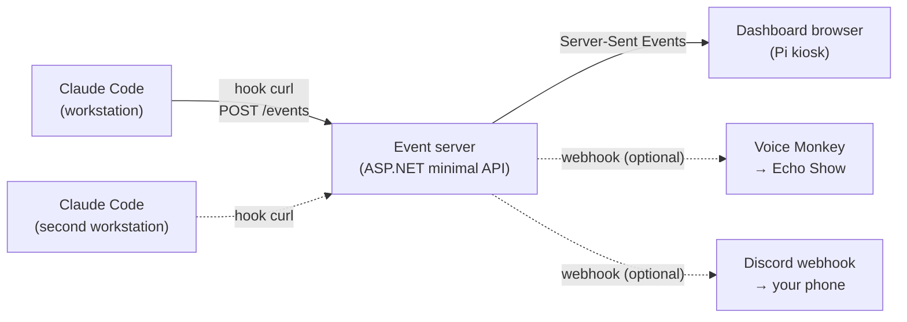

# Claude Focus Wall

A wall-mounted Raspberry Pi dashboard that surfaces Claude Code session state in real time, so you know when Claude is waiting on you and when it's safe to stay in deep work elsewhere.

## Why this exists

When Claude Code is doing long-running work — multi-step refactors, test runs, agentic loops — you can shift to another task. The cost is missing the moment Claude actually needs your input (permission prompts, completion handoffs), which silently kills the loop. This dashboard turns that moment into something you can see from across the room.

## At a glance

- **Hero status** readable from 10 feet: idle / working / waiting / done
- **Event log** of recent hook fires (Notification, Stop, PreToolUse, PostToolUse, SessionStart/End)
- **Session metrics** — total sessions, tool calls, edits, time since last event
- **Rotating wall view** — a `/wall` kiosk page that auto-alternates the per-session grid and the loudest-status hero without reloading (`?rotate=<seconds>`), with a configurable RSS news ticker along the bottom
- **Mobile companion view** — a phone-optimized `/mobile` page: a sticky loudest-status glance banner over a scrollable single-column session list, on the same live stream (LAN-only)
- **Multi-session by design** — run any number of Claude Codes in parallel; the hero always shows the "loudest" (waiting > working > done > idle) so a working session can't mask a waiting one
- **Multi-host capable** — same server handles multiple workstations, each session tagged with its origin
- **Optional notification channels** — Echo Show voice announcements and Discord push notifications, both driven by the same status stream
- **Reuses your stack** — ASP.NET minimal API, Docker, all familiar tooling

## Architecture in one diagram

The server is the single source of truth. The Pi wall display is the primary surface. Echo Show and Discord are optional layered channels for when you're not in sight of the wall — Echo for the room, Discord for anywhere.

## Documents

| File | What's in it |
|------|--------------|
| [GETTING_STARTED.md](./GETTING_STARTED.md) | **Start here.** Sequenced, top-to-bottom walkthrough of the local build |
| [ARCHITECTURE.md](./ARCHITECTURE.md) | Components, data flow, state model, design decisions |
| [IMPLEMENTATION.md](./IMPLEMENTATION.md) | Project layout, all code, build steps |
| [HARDWARE.md](./HARDWARE.md) | Bill of materials, total cost, physical install |
| [DEPLOYMENT.md](./DEPLOYMENT.md) | Pi OS setup, kiosk mode, systemd, networking |
| [PHASE2-RUNBOOK.md](./PHASE2-RUNBOOK.md) | Do-this-now checklist for Pi deploy + kiosk (includes the optional self-hosted-runner path) |
| [ECHO_SHOW.md](./ECHO_SHOW.md) | Optional: voice announcements on an existing Echo Show (design + `EchoAnnouncer` code) |
| [ECHO_SETUP_CHECKLIST.md](./ECHO_SETUP_CHECKLIST.md) | Do-this-now checklist to turn on Echo Show announcements (Voice Monkey → GitHub secrets → deploy → verify) |
| [DISCORD.md](./DISCORD.md) | Optional: push notifications via Discord webhook (design + `DiscordNotifier` code) |
| [DISCORD_SETUP_CHECKLIST.md](./DISCORD_SETUP_CHECKLIST.md) | Do-this-now checklist to turn on Discord notifications (webhook → GitHub secret → deploy → verify) |

## Cost and time

| Tier | Hardware cost | Build time |
|------|---------------|------------|
| Budget (Pi 4 2GB + cheap HDMI monitor) | ~$120 | 1 weekend |
| Recommended (Pi 5 4GB + 14" portable monitor + mount) | ~$200 | 1-2 weekends |
| With Discord push notifications | $0 | +30 min |
| With Echo Show voice announcements | $0 if you already own one | +1 evening |

See `HARDWARE.md` for the detailed bill of materials.

## Success criteria

The build is "done" when all of these are true:

1. From across the room, you can tell within 1 second whether Claude needs you.
2. Hooks fire to the dashboard with under 100ms perceived latency.
3. **Running two Claude Code sessions in parallel, the hero holds "Waiting for you" for as long as any session is waiting, even while other sessions keep firing tool events.**
4. The Pi auto-recovers — power cycle returns to the running dashboard in under 60s without manual intervention.
5. The system survives 7+ days of continuous uptime without intervention.
6. A second workstation can be added by copying two files onto it — no server changes.

## Status

This is a complete, working build. The server, the three dashboard views, the Chromium kiosk setup, and both optional notification channels are all implemented and documented; it has run on a wall-mounted Raspberry Pi 4.

- **Core dashboard** — implemented. ASP.NET minimal API on `net10.0` under `src/FocusWall.Server/`, with xunit tests in `tests/FocusWall.Server.Tests/` (14/14 passing), including the multi-session "loudest wins" acceptance test (success criterion #3). Runs in Docker on a Pi in Chromium kiosk mode; the build self-recovers within ~60s of a hard power-cycle. See `PHASE2-RUNBOOK.md` for the deploy/kiosk runbook (including the Wayland Chromium flags).
- **Discord push notifications** — implemented. `DiscordNotifier` fires an amber embed to a Discord webhook whenever any session transitions to `waiting`, with per-session cooldown and optional quiet hours; it self-disables cleanly when no webhook is configured, so the dashboard is never affected. See `DISCORD.md` / `DISCORD_SETUP_CHECKLIST.md`.
- **Echo Show voice announcements** — implemented. `EchoAnnouncer` fires a Voice Monkey webhook that makes an Echo Show speak the alert out loud on any transition to `waiting`, with the same cooldown + quiet-hours behavior. Ships self-disabled until `VOICEMONKEY_TOKEN`/`VOICEMONKEY_DEVICE` are set. See `ECHO_SHOW.md` / `ECHO_SETUP_CHECKLIST.md`.

Both notification channels read their secrets from environment variables (a gitignored `.env`) and never log them.

## Deploying

The simplest path is manual: on the Pi, `docker compose up -d --build` to run it, and `git pull && docker compose up -d --build` to update. Full walkthrough — OS flash → Docker → kiosk → wall mount — is in `DEPLOYMENT.md`. Point your workstation hooks at the Pi (its LAN IP or `focus-wall.local`); the installer in `hooks/` sets this up.

An optional auto-deploy path — a self-hosted GitHub Actions runner on the Pi that redeploys on every push to `main` — is documented in `DEPLOYMENT.md` § 4a, with the workflow YAML in `IMPLEMENTATION.md`. **That workflow file is intentionally _not_ included in this repository.** A self-hosted runner on a *public* repo lets anyone's PR execute code on your hardware, so only add it if you keep your fork private. See the warning in `DEPLOYMENT.md`.

## Security & threat model

This runs on a **trusted LAN**. `POST /events` is unauthenticated and there is no TLS — anyone on the same network can post events (worst case, garbage on your dashboard). Log rows and RSS titles are rendered with `textContent`, never `innerHTML`. Don't expose the server to the public internet. Notification secrets (Discord webhook, Voice Monkey token) live only in a gitignored `.env` and are never logged. See `ARCHITECTURE.md` § "Failure modes & threat model".

## License

[MIT](./LICENSE) © Ricardo Cantu
# ClaudeFocusWall
