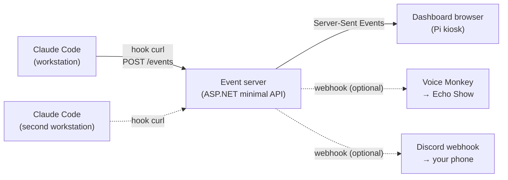

# Claude Focus Wall

A wall-mounted Raspberry Pi dashboard that surfaces Claude Code session state in real time, so you know when Claude is waiting on you and when it's safe to stay in deep work elsewhere.

## Why this exists

When Claude Code is doing long-running work — multi-step refactors, test runs, agentic loops — you can shift to another task. The cost is missing the moment Claude actually needs your input (permission prompts, completion handoffs), which silently kills the loop. This dashboard turns that moment into something you can see from across the room.

## At a glance

- **Hero status** readable from 10 feet: idle / working / waiting / done
- **Event log** of recent hook fires (Notification, Stop, PreToolUse, PostToolUse, UserPromptSubmit, SessionStart/End)
- **Session metrics** — total sessions, tool calls, edits, time since last event
- **Kiosk wall view** — a `/wall` kiosk page that frames the loudest-status hero (`/hero`) between two configurable RSS news tickers (general news along the top, sports along the bottom, each item date-stamped); the hero's bottom band crossfades session metrics, the recent-events log, and the usage gauges in place without reloading (`?rotate=<seconds>`)
- **Mobile companion view** — a phone-optimized `/mobile` page: a sticky loudest-status glance banner over a scrollable single-column session list, on the same live stream (LAN-only)
- **Snooze** — a 30m/1h/clear remote on `/mobile` silences the "waiting" pulse and Echo/Discord push without touching the underlying state; Notification events still log
- **Usage limits page** — a `/usage` page of per-account subscription limit gauges (the data behind Claude Code's `/usage` command), fed by a per-workstation poller (macOS, Linux, and Windows); only the reduced summary leaves the workstation, never the OAuth token
- **Multi-session by design** — run any number of Claude Codes in parallel; the hero always shows the "loudest" (waiting > working > done > idle) so a working session can't mask a waiting one
- **Multi-host capable** — same server handles multiple workstations, each session tagged with its origin
- **Optional notification channels** — Echo Show voice announcements and Discord push notifications, both driven by the same status stream
- **Reuses your stack** — ASP.NET minimal API, Docker, all familiar tooling

## Architecture in one diagram

The server is the single source of truth. The Pi wall display is the primary surface. Echo Show and Discord are optional layered channels for when you're not in sight of the wall — Echo for the room, Discord for anywhere.

## Documents

| File | What's in it |
|------|--------------|
| [GETTING_STARTED.md](./GETTING_STARTED.md) | **Start here.** Sequenced, top-to-bottom walkthrough of Phase 0–1 |
| [ARCHITECTURE.md](./ARCHITECTURE.md) | Components, data flow, state model, design decisions |
| [IMPLEMENTATION.md](./IMPLEMENTATION.md) | Project layout, all code, build steps |
| [HARDWARE.md](./HARDWARE.md) | Bill of materials, total cost, physical install |
| [DEPLOYMENT.md](./DEPLOYMENT.md) | Pi OS setup, kiosk mode, systemd, networking |
| [PHASE2-RUNBOOK.md](./PHASE2-RUNBOOK.md) | Do-this-now checklist for Phase 2b + 3: Pi deploy via self-hosted runner, then kiosk |
| [ECHO_SHOW.md](./ECHO_SHOW.md) | Optional: voice announcements on an existing Echo Show (design + `EchoAnnouncer` code) |
| [ECHO_SETUP_CHECKLIST.md](./ECHO_SETUP_CHECKLIST.md) | Do-this-now checklist to turn on Echo Show announcements (Voice Monkey → GitHub secrets → deploy → verify) |
| [DISCORD.md](./DISCORD.md) | Optional: push notifications via Discord webhook (design + `DiscordNotifier` code) |
| [DISCORD_SETUP_CHECKLIST.md](./DISCORD_SETUP_CHECKLIST.md) | Do-this-now checklist to turn on Discord notifications (webhook → GitHub secret → deploy → verify) |

## Cost and time

| Tier | Hardware cost | Build time |
|------|---------------|------------|
| Budget (Pi 4 2GB + cheap HDMI monitor) | ~$120 | 1 weekend |
| Recommended (Pi 5 4GB + 14" portable monitor + mount) | ~$200 | 1-2 weekends |
| With Discord push notifications | $0 | +30 min |
| With Echo Show voice announcements | $0 if you already own one | +1 evening |

See `HARDWARE.md` for the detailed bill of materials.

## Success criteria

The build is "done" when all of these are true:

1. From across the room, you can tell within 1 second whether Claude needs you.
2. Hooks fire to the dashboard with under 100ms perceived latency.
3. **Running two Claude Code sessions in parallel, the hero holds "Waiting for you" for as long as any session is waiting, even while other sessions keep firing tool events.**
4. The Pi auto-recovers — power cycle returns to the running dashboard in under 60s without manual intervention.
5. The system survives 7+ days of continuous uptime without intervention.
6. A second workstation can be added by copying two files onto it — no server changes.

## Status

**The dashboard is live on a wall-mounted Raspberry Pi 4.** The server (`src/FocusWall.Server/`, ASP.NET minimal API on `net10.0`) and its xunit tests (`tests/FocusWall.Server.Tests/`, 35/35 passing) run locally, and the multi-session "loudest wins" acceptance test — success criterion #3 above — passes. The container runs on the Pi (hostname `focus-wall`), a self-hosted GitHub Actions runner auto-redeploys on every push to `main`, and workstation hooks report over LAN to the Pi at `focus-wall.local` (or its LAN IP if mDNS is unreliable on your network). Kiosk mode is live: labwc (Wayland) autostart launches Chromium fullscreen on `/wall`, and the build self-recovers within ~60s of a hard power-cycle. See `PHASE2-RUNBOOK.md` for the deploy/kiosk runbook (including the Wayland Chromium flags).

**Views:** a composed **hero dashboard** (`/hero`, the kiosk default via `/wall`, which wraps it in two RSS news tickers — news top, sports bottom), a per-session **grid** (`/`), a phone-optimized **mobile** view (`/mobile`, home of the snooze control), and a **usage** page (`/usage`) showing each Claude account's subscription-limit gauges.

**Notifications & extras** — all optional, and all self-disable cleanly when unconfigured so the dashboard is never affected:

- **Discord push** (`DiscordNotifier`) — live, delivering real phone pushes. Fires an amber embed to a webhook whenever any session transitions to `waiting`, with per-session cooldown + optional quiet hours. See `DISCORD_SETUP_CHECKLIST.md`.
- **Echo Show voice** (`EchoAnnouncer`) — makes an Echo Show speak "Claude is waiting for your input" via a Voice Monkey webhook, with the same cooldown/quiet-hours behavior. See `ECHO_SETUP_CHECKLIST.md`.
- **Snooze** — silence the waiting alert for 30m / 1h from the mobile view; a global presentation overlay that suppresses the notifiers without touching per-session state.
- **Slack panel** — your own unread badge (mentions / DMs / channels / threads + presence) per workspace, shown on the hero. Best-effort; see `SLACK_SETUP_CHECKLIST.md`.

The remaining polish items (the physical wall mount, a second workstation) are optional and ahead.
